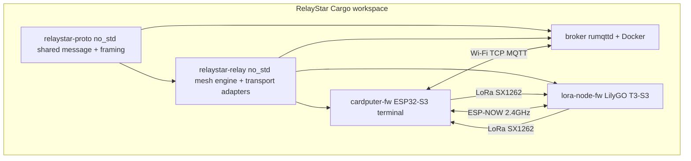

# RelayStar

A Rust workspace for a multi-transport messaging mesh spanning **LoRa**, **MQTT**, and **ESP-NOW**.



## Components

| Crate | Target | Role |
| --- | --- | --- |
| [`crates/relaystar-proto`](crates/relaystar-proto) | host + `no_std` | Shared wire format ([`Message`], [`Fragment`]), postcard framing, per-transport `max_payload()` |
| [`crates/relaystar-relay`](crates/relaystar-relay) | host + `no_std` | Mesh engine: automatic MTU-aware fragmentation & reassembly, dedup, receiver-table learning, unicast/broadcast fan-out. Ships `LoraPort` / `EspNowPort` / `MqttPort` adapters generic over a small hardware trait per transport. |
| [`crates/broker`](crates/broker) | host | `rumqttd` MQTT broker, deployed via Docker |
| [`crates/cardputer-fw`](crates/cardputer-fw) | `xtensa-esp32s3-none-elf` | M5Stack Cardputer-Adv terminal: LoRa + MQTT + ESP-NOW + display + keyboard, acts as the **cross-transport relay** (driven by `relaystar-relay`) |
| [`crates/lora-node-fw`](crates/lora-node-fw) | `xtensa-esp32s3-none-elf` | LilyGO T3-S3 simple LoRa node with OLED (also driven by `relaystar-relay`) |

## Prerequisites

- Rust stable (host crates) — installed.
- Espressif Xtensa toolchain for the firmware:

```bash
cargo install espup espflash
espup install          # installs the "esp" toolchain used by the firmware crates
```

## Building

The whole build flow is orchestrated with [`cargo-make`](https://github.com/sagiegurari/cargo-make)
(see [`Makefile.toml`](Makefile.toml)), which handles the two-toolchain split
(stable for host crates, `esp` + `-Z build-std` for the Xtensa firmware).

```bash
cargo install cargo-make      # one-time

cargo make check-all          # build host + tests + both firmwares (default task)
cargo make build-all          # build host crates + both firmware images
cargo make fw-build           # build both firmware images only
cargo make broker             # run the MQTT broker
cargo make flash-node         # flash + monitor the LoRa node
cargo make flash-card         # flash + monitor the Cardputer
cargo make format             # rustfmt across all crates
cargo make clippy             # clippy across all crates
cargo make clean-all          # clean everything
cargo make docker-up          # build + run the broker via docker compose
```

Run `cargo make --list-all-steps` to see every task.

### Or build directly with cargo

Host crates (workspace default members):

```bash
cargo build            # builds relaystar-proto + broker
cargo test -p relaystar-proto
```

Firmware crates are excluded from the host workspace (different target). Build
each from its own directory:

```bash
cd crates/lora-node-fw && cargo build --release
cd crates/cardputer-fw && cargo build --release
```

## Running the broker

```bash
cd docker
docker compose up --build     # MQTT v3.1.1 on :1883, v5 on :1884, ws on :8080
```

You can also run it directly on the host:

```bash
RELAYSTAR_BROKER_CONFIG=docker/rumqttd.toml cargo run -p relaystar-broker
```

## Configuring the firmware

Set your Wi-Fi credentials and broker address in
[`crates/cardputer-fw/.cargo/config.toml`](crates/cardputer-fw/.cargo/config.toml)
under `[env]` before building:

```toml
[env]
SSID = "your-wifi-ssid"
PASSWORD = "your-wifi-password"
BROKER_IP = "192.168.1.10"   # IPv4 of the machine running the broker
BROKER_PORT = "1883"
```

Region/radio parameters (frequency, spreading factor, etc.) are shared by all
nodes in [`crates/relaystar-proto/src/lib.rs`](crates/relaystar-proto/src/lib.rs)
(`radio` module); the default is EU868.

## Flashing firmware

```bash
cd crates/lora-node-fw && cargo run --release   # uses the espflash runner
cd crates/cardputer-fw && cargo run --release
```

## MQTT topic convention

Two topic families coexist so nodes and gateways can pick either.

### Legacy (currently used by `cardputer-fw`)

To avoid self-echo loops through the broker, the terminal uses split topics:

- Publish to `relaystar/uplink` to inject a message **into** the mesh.
- Subscribe to `relaystar/downlink` to observe messages **from** the mesh.

### Relay-native (used by anything built on `relaystar-relay::ports::mqtt`)

- `relaystar/b` — broadcast to the whole mesh.
- `relaystar/u/{hex-addr}` — unicast to a single node identified by its 6-byte
  address rendered as 12 lowercase hex chars, e.g.
  `relaystar/u/020000000001`.

A host-side mesh gateway can subscribe to `relaystar/#` and hand each PUBLISH
payload to [`Relay::ingest`](crates/relaystar-relay) for uniform decoding,
dedup, and reassembly.

## Message flow

Every transport carries the same `relaystar-proto::Message`. All mesh nodes
delegate the heavy lifting to [`relaystar-relay`](crates/relaystar-relay),
which provides:

- **Automatic MTU-aware fragmentation** when a payload exceeds a transport's
  `max_payload()` (LoRa ≈ 180 B, ESP-NOW ≈ 200 B, MQTT effectively unbounded).
- **Automatic reassembly** on the receive side.
- **Deduplication** via a rolling seen-cache (fragment-aware).
- **Receiver-table learning**: every inbound frame's `from` address is
  recorded against its arrival transport, so subsequent unicast sends resolve
  without any manual peer registration.
- **Unicast vs broadcast fan-out** using each transport's native addressing
  facility (ESP-NOW MAC unicast/broadcast, MQTT topic naming, LoRa link-layer
  address).

On the Cardputer terminal, [`bridge`](crates/cardputer-fw/src/bridge.rs) wraps
a `static Mutex<Relay<16,4,32>>` and drives three embassy transport tasks. On
the LoRa node ([`lora-node-fw/src/main.rs`](crates/lora-node-fw/src/main.rs))
a single `Relay<8,2,32>` handles heartbeat broadcasts and unicast Pong replies
to Pings.

See [`crates/relaystar-relay/README.md`](crates/relaystar-relay/README.md) for
integration details and the tiny hardware trait each transport adapter needs.

## End-to-end test

1. Start the broker (`docker compose up` in `docker/`).
2. Flash and power the Cardputer (configured with your Wi-Fi + broker IP) and the
   LilyGO T3-S3 LoRa node.
3. Observe mesh traffic and inject a message from the MQTT side:

```bash
# Watch messages coming out of the mesh (the LoRa node's heartbeats appear here):
mosquitto_sub -h localhost -p 1883 -t 'relaystar/downlink' -v &

# Inject a message into the mesh; it is relayed to LoRa + ESP-NOW:
mosquitto_pub -h localhost -p 1883 -t 'relaystar/uplink' -m 'hello from mqtt'
```

The injected text should appear on the LoRa node's OLED, and the node's
heartbeats should print on the `relaystar/downlink` subscription and the
Cardputer's screen.

## Toolchain notes

- Firmware crates build for `xtensa-esp32s3-none-elf` using the `esp` toolchain
  and `-Z build-std` (configured per-crate in `.cargo/config.toml`).
- Host crates (`relaystar-proto`, `relaystar-relay`, `relaystar-broker`) build
  with stable Rust.
